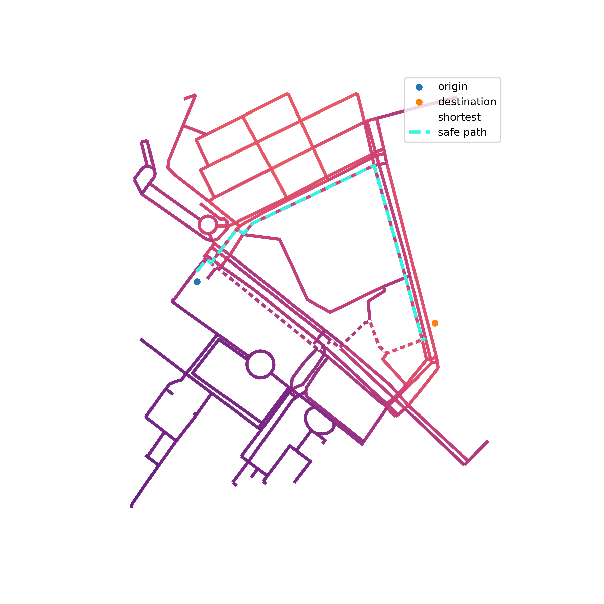

# SafeMap-Web

<div align="center">
  
  
  
  **A smart route planning web application that finds the safest and brightest paths**
  
  [](https://python.org)
  [](https://reactjs.org)
  [](https://flask.palletsprojects.com)
</div>

## Overview

SafeMap Web is an intelligent route planning application that prioritizes safety by analyzing street lighting and surveillance coverage. Unlike traditional routing systems that only consider distance and travel time, SafeMap calculates the **safest routes** by incorporating real-world safety data, including streetlight density and security camera coverage.

*This project currently supports only routing within [Hsinchu City, Taiwan](https://www.google.com/maps/place/新竹市).*

## Key Features
- **Safety-First Routing**: Advanced algorithm that balances distance with safety factors
- **Lighting Analysis**: Considers streetlight density for well-lit route recommendations  
- **Security Coverage**: Integrates surveillance camera data for enhanced safety assessment
- **Google Maps Integration**: Integration with Google Maps API for visualization
- **Real-time Optimization**: Dynamic route calculation using (bidirectional) Dijkstra or A* algorithm

------

## Installation
### Backend
- Python 3.9.x
- Flask 3.1.1
- OSMnx 1.3.0
- NumPy & Pandas
- Matplotlib & Seaborn

**Conda environment is recommended:**
   ```bash
   conda config --prepend channels conda-forge
   conda create -n safemap --strict-channel-priority osmnx=1.3.0 python=3.9
   conda activate safemap
   conda install anaconda::flask=3.1
   ```
### Frontend
- Node.js
- **Google Maps API Key** ([Get one here](https://console.cloud.google.com/google/maps-apis/start))
1. **Install Node.js Dependencies**
   ```bash
   cd frontend
   npm install
   ```

2. **Configure Google Maps API**
   
   Create a `.env.local` file in the `frontend` directory:
   ```env
   REACT_APP_GOOGLE_MAPS_API_KEY=your_google_maps_api_key_here
   ```

## Quick Start

### Option 1: Manual Start

**Terminal 1 - Backend:**
```bash
cd backend
conda **activate** safemap
python app.py
```

**Terminal 2 - Frontend:**
```bash
cd frontend
npm start
```

### Option 2: One-Click Start (Windows)
Create a `start.bat` file in the project root:
```batch
start cmd.exe /C "cd frontend && npm start"
start cmd.exe /C "cd backend && conda activate safemap && python app.py"
```

Double-click the `.bat` file to start both services simultaneously.

## Usage

1. **Access the Application**: Open your browser and navigate to `http://localhost:3000`
2. Fill in the origin and destinaiton
3. Select safety factor (0: shortest path, 1: safest)
4. Press **Calculate Route** to show the results.
5. Press the button **X** to clear the results.

## Acknowledgments
- **Data**:
    - [新竹市公有道路路燈資料 (Hsinchu City Public Road Street Light Information)](https://opendata.hccg.gov.tw/OpenDataDetail.aspx?n=1&s=159)
    - [新竹市錄影監視系統設置地點 (Locations for video surveillance systems in Hsinchu City)](https://opendata.hccg.gov.tw/OpenDataDetail.aspx?n=1&s=155)
- **Frontend Base**: The React frontend implementation is based on the [Google Maps Directions tutorial](https://github.com/trulymittal/google-maps-directions-tutorial) by Truly Mittal
- **[OpenStreetMap](https://www.openstreetmap.org)**: For providing comprehensive map data through OSMnx
- **Google Maps API**: For map visualization and user interface components

